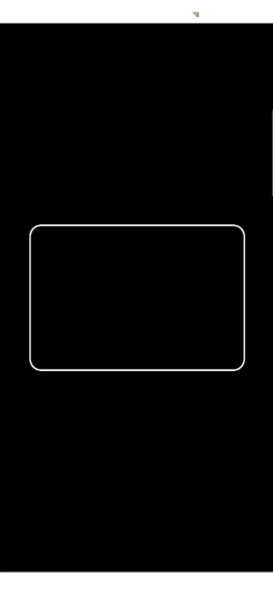

# 📸 Scanpose Barcode Scanner


A lightweight, easy-to-use **Barcode ** component for **Compose Multiplatform** (Android & iOS).
Built with **CameraX & MLKit** on Android and **AVFoundation** on iOS.

## ✨ Features

- 📷 **Camera Preview**: Seamless integration with platform-native camera views.
- ⚡ **Fast Scanning**: Optimized performance using MLKit (Android) and AVFoundation (iOS).
- 🔄 **Compose Multiplatform**: Single common API for both platforms.
- 🛡️ **Permission Handling**: Includes a helper `PermissionRequester` for handling camera permissions.
- 🔦 **Debounce Support**: Prevents rapid duplicate scans (implemented in iOS coordinator, logic recommended for Android callback).

## 🧩 Screenshots

<table>
<tr>
<td><br/></td>
<td><br/></td>
</tr>
</table>

## 📦 Installation

This module is designed to be integrated into your Compose Multiplatform project.

1.  **Copy the module**: Copy the `scanner` directory into your project root.
2.  **Include the module**: Add it to your `settings.gradle.kts`:
    ```kotlin
    include(":scanner")
    ```
3.  **Add dependency**: In your shared module's `build.gradle.kts` (or where you want to use it):
    ```kotlin
    commonMain.dependencies {
        implementation(project(":scanner"))
    }
    ```

## 🛠️ Configuration

### Android

1.  Add camera permission to your `androidApp/src/main/AndroidManifest.xml`:
    ```xml
    <uses-permission android:name="android.permission.CAMERA" />
    ```

2.  Ensure your `minSdk` is at least **21** (CameraX requirement).

### iOS

1.  Add the camera usage description to your `iosApp/iosApp/Info.plist`:
    ```xml
    <key>NSCameraUsageDescription</key>
    <string>Camera permission is required to scan barcodes.</string>
    ```

## 🚀 Usage

The component is designed to be used within a Compose UI. You **must** handle camera permissions before showing the scanner.

### 1. Request Permissions

Use the provided `rememberPermissionRequester` to handle permissions easily.

```kotlin
import com.arcadone.scanpose.scanner.BarcodeScanner
import com.arcadone.scanpose.scanner.rememberPermissionRequester
import androidx.compose.runtime.*

@Composable
fun ScanScreen() {
    val permissionRequester = rememberPermissionRequester()
    var isPermissionGranted by remember { mutableStateOf(false) }

    LaunchedEffect(Unit) {
        // Check if permission is already granted
        isPermissionGranted = permissionRequester.isPermissionGranted()
        
        if (!isPermissionGranted) {
            // Request permission
            isPermissionGranted = permissionRequester.requestPermission()
        }
    }

    if (isPermissionGranted) {
        BarcodeScanner(
            modifier = Modifier.fillMaxSize(),
            onBarcodeScanned = { barcode ->
                println("Scanned code: $barcode")
                // Handle the scanned code (e.g., navigate or show result)
            }
        )
    } else {
        // Show a UI explaining why permission is needed
        Text("Camera permission is required to scan.")
    }
}
```

## 🧩 Component Details

### `BarcodeScanner`

The main composable function.

| Parameter | Type | Description |
| :--- | :--- | :--- |
| `modifier` | `Modifier` | Modifiers to apply (e.g., `fillMaxSize`, size). |
| `onBarcodeScanned` | `(String) -> Unit` | Callback triggered when a barcode is successfully detected. Passes the raw string value of the code. |

### `PermissionRequester`

A helper interface to abstract platform-specific permission logic.

-   `isPermissionGranted(): Boolean`: Checks current status.
-   `requestPermission(): Boolean`: Requests permission from the user (suspending function).

## 📄 License

Licensed under the [Apache License, Version 2.0](http://www.apache.org/licenses/LICENSE-2.0).
